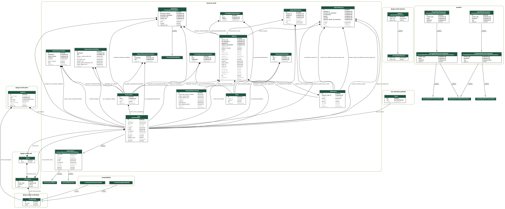

# resources_portal

[](https://travis-ci.org/ccdl/resources_portal)
[](https://github.com/agconti/cookiecutter-django-rest)

Resources Portal. Check out the project's [documentation](http://ccdl.github.io/resources_portal/).

# Prerequisites

- [Docker](https://docs.docker.com/docker-for-mac/install/)

## Optional

You can run the `rportal` command with `./bin/rportal` from the root directory of this project.
Optionally you can add this project's `/bin` folder to your path and then call it directly.

# Initialize the project

Start the dev server for local development:

```bash
rportal up
```

Create a superuser to login to the admin:

```bash
rportal createsuperuser
```

# Making migrations

```bash
rportal makemigrations
```

# Visualizing the data model

This project includes [django-extensions graph_models command](https://django-extensions.readthedocs.io/en/latest/graph_models.html).

```bash
rportal graph-models
```

At the moment png exports are not setup but these can be generated from the `.dot` file.
(Either with `dot -Tpng model.dot -o database_diagram.png` or https://convertio.co/dot-png/)


